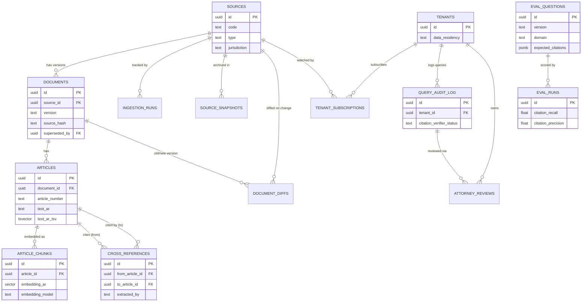

# ADL.AI Corpus Ingestion

Postgres + pgvector ingestion, indexing, and hybrid-retrieval pipeline for the ADL.AI legal corpus (KSA regulatory sources). Replaces the earlier ChromaDB prototype. Implements the schema, ingestion pipeline, multi-tenant RLS isolation, and eval suite described in the ADL.AI Postgres + pgvector Ingestion Spec v1.0.

## Architecture

- **Corpus store**: `sources` -> `documents` (versioned) -> `articles` -> `article_chunks` (embedded, retrievable units).
- **Vector + text index**: HNSW (`vector_cosine_ops`) on `article_chunks.embedding_ar` / `embedding_en`; generated `tsvector` columns on `articles` for Arabic (`simple` config on normalized text) and English (`english` config), with `pg_trgm` for fuzzy citation lookup.
- **Hybrid retrieval**: dense (pgvector cosine) + sparse (`ts_rank`) fused by summed score (`src/repositories/searchRepository.js`). No reranker in this layer — a cross-encoder reranker is app-layer, out of scope for this repo.
- **Provenance**: every `document` carries a `source_hash` and links to the `ingestion_run` that created it; raw fetches are archived in `source_snapshots`.
- **AI Watch**: `document_diffs` records what changed between two versions of a source; `src/cli/watch.js` fans out impact analysis + notifications to subscribed tenants.
- **Multi-tenant isolation**: Row-Level Security. Corpus tables (`sources`/`documents`/`articles`/`article_chunks`) are global and shared; `query_audit_log` and `attorney_reviews` are tenant-scoped with RLS enforced via `SET LOCAL app.current_tenant_id` (see `src/utils/tenantContext.js`). RLS only takes effect because the app connects as a non-superuser role (`adlai_app`, migration `013_create_app_role.sql`) — Postgres superusers bypass RLS unconditionally.
- **Eval suite**: `eval_questions` (attorney-authored, per domain) scored against live hybrid retrieval by `src/services/evalRunnerService.js`, recorded in `eval_runs`. This is what the ChromaDB-to-Postgres cutover decision is measured against.

## Schema



## Setup

```bash
docker compose up -d      # Postgres 17 + pgvector on localhost:5433
cp .env.example .env      # fill in DB_* and COHERE_API_KEY
npm install
npm run migrate           # applies src/migrations/*.sql in order, tracked in schema_migrations
```

## CLI

| Command | Purpose |
|---|---|
| `npm run ingest -- --source <name> [--dry-run]` | Run the ingestion pipeline for one source (or all sources if `--source` is omitted). Reads pre-parsed articles from `output/<name>.json`. |
| `npm run search -- --query "<text>" [--limit N]` | Hybrid dense+sparse search against `article_chunks`, logs the query to `query_audit_log`. |
| `npm run watch` | Processes pending `document_diffs`, runs impact analysis, notifies subscribed tenants. |
| `npm run eval -- --version v1 [--top-k 3]` | Runs `eval_questions` for a version against live retrieval, records one row in `eval_runs`. |
| `npm test` | Runs `test/unit/*` and `test/integration/*` (`node --test`, no extra dependency). Integration tests skip themselves if Postgres isn't reachable. |

## Scripts

Not npm-aliased, run directly with `node`:

| Script | Purpose |
|---|---|
| `node scripts/load-test.js [--clones-per-source N]` | Spec section 9 load test: clones the real corpus `N`x (default 10) into synthetic sources, runs them through the real ingestion pipeline with embeddings stubbed, reports throughput, then removes every synthetic row/file it created. |
| `node scripts/import-eval-questions.js --file <csv> [--dry-run]` | Imports attorney-authored eval questions from a CSV (see `scripts/eval-questions-template.csv`) into `eval_questions`. |
| `node scripts/extract-pdf.js --file <pdf> --out <name>` | Re-extracts a source PDF to `output/<name>.extracted.json`, flagging likely-corrupted articles for manual review. Does not overwrite the original automatically. |

## Known gaps (v1)

This repo covers the corpus schema, ingestion pipeline, hybrid retrieval, RLS isolation, and eval runner. Not yet done:

- **Source parsing**: no PDF/HTML/docx parser classes in this repo — ingestion reads already-parsed JSON from `output/`, produced by a separate scraper. Needs confirmation on whether that split is permanent. `scripts/extract-pdf.js` is a real re-extraction tool for cases where the original parse is corrupted (built for `ZATCA_VAT_AGREEMENT`, which still has source-level corruption — see the script's own comments; it's a best-effort tool, not a guaranteed fix).
- **ChromaDB cutover** (shadow mode, recall@3 comparison, `use_postgres_retrieval` feature flag): not started.
- **Eval question set**: the runner works end-to-end, but needs a real attorney-authored question set per domain before its numbers mean anything for a cutover decision. `scripts/import-eval-questions.js` + `scripts/eval-questions-template.csv` let an attorney author questions in a spreadsheet and import them without touching the DB directly — the tooling is ready, the actual questions still need a real attorney to write them.
- **AI Watch**: diff detection and the notification loop work; `llm_impact_analysis` is currently a rule-based stub, and notification delivery is a console log, not a real channel.
- **`query_audit_log` partitioning** (monthly, per spec) and retention jobs (90d standard / 365d sovereign): not implemented — deprioritized (not required for the pipeline to work, revisit if/when audit log volume becomes a real problem).
- `.env`-based CI wiring: not implemented.

## Author

Salwa Essid — Data / Ingestion